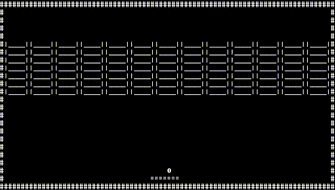

# RL Driven nanoGPT

This project builds upon [nanoGPT](https://github.com/karpathy/nanoGPT) but rather than performing Supervised Learning it uses a custom ASCII representation of the Atari game Breakout and performs Reinforcement Learning. It uses a GPT-based architecture combined with Proximal Policy Optimization (PPO) to train a model from scratch to play the game. 

## Overview

This project leverages a Generative Pretrained Transformer (GPT) as the backbone for a policy network that is trained using the PPO algorithm. The agent interacts with a custom-built Atari Breakout environment rendered in ASCII. Observations from the environment are converted into sequences of token IDs (based on ASCII values) and then processed by the GPT-based policy to determine actions. The training loop includes rollout collection, PPO updates, periodic evaluation, and checkpointing.

## Performance

## Features

- **Custom ASCII Breakout Environment:** An ASCII-based version of the Breakout game.
- **GPT-Based Policy Architecture:** Uses a GPT model (configured via GPTConfig in model.py) to process textual observations.
- **Proximal Policy Optimization (PPO):** Implements PPO with clipping, value function loss clipping, and entropy regularization.
- **Rollout Buffer:** Collects experiences and computes returns and advantages using Generalized Advantage Estimation (GAE).
- **Evaluation and Testing:** Includes routines for both online evaluation during training and a testing phase with deterministic action selection.
- **Callbacks:** A minimal callback system to log events during training (e.g., rollout start/end, training start/end).

## Installation

1. **Clone the repository:**

   git clone https://github.com/Dev1nW/RL_Driven_nanoGPT.git
   cd RL_Driven_nanoGPT

2. **Create a virtual environment and install dependencies:**

   conda create -n RL_GPT python=3.9
   conda activate RL_GPT

   pip install -r requirements.txt

## Usage

### Training

To start training your GPT-PPO agent in Breakout, run:

     python train_ppo.py

The training script initializes the environment, the GPT-based PPO policy, sets up a rollout buffer and a callback, then runs the training loop with rollout collection, PPO updates, periodic evaluation, and checkpoint saving.

### Trained Rollouts

To generate a rollout of 1000 steps of your GPT-PPO agent, run:
    
     python load_model.py

This will use the best model checkpoint to choose 1000 steps worth of actions and save a video of the performance.

## Hyperparameters

Key hyperparameters include:
- **BLOCK_SIZE:** 1944 (24 × 81) – length of tokenized ASCII observation.
- **NUM_STEPS:** 4,000,000 – total training steps.
- **ROLLOUT_STEPS:** 1024 – steps per rollout.
- **EPOCHS:** 10 – epochs per PPO update.
- **GAMMA:** 0.99 – discount factor.
- **LAMBD:** 0.95 – GAE lambda.
- **EPS_CLIP:** 0.2 – PPO clipping range.
- **LR:** 0.001 – learning rate.
- Other parameters are defined for the optimizer, scheduler, and loss coefficients.
